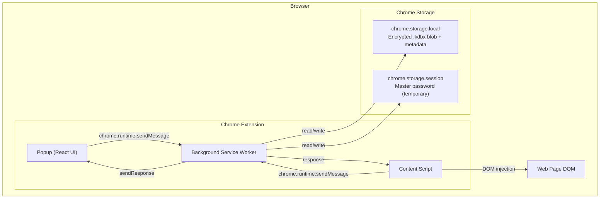
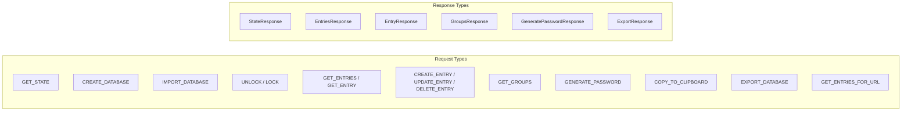
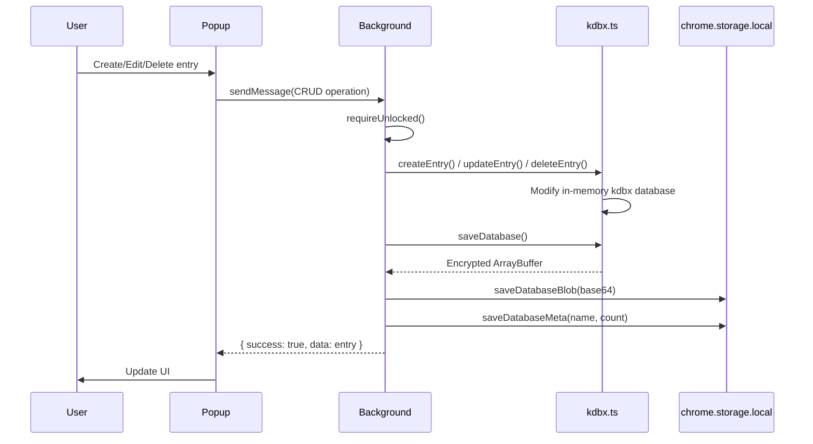
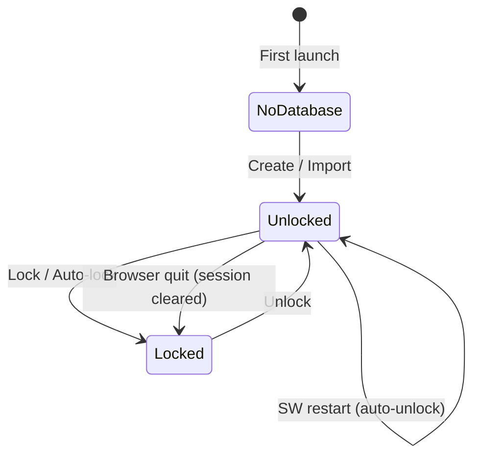

# KeePass Chrome Extension

KeePass-совместимый менеджер паролей в виде расширения для Chrome. Работает полностью в браузере — все данные шифруются локально и никуда не отправляются.

## Возможности

- **Создание и открытие `.kdbx` баз** — полная совместимость с KeePass 2.x
- **Импорт/экспорт** — можно открыть существующую базу KeePass или создать новую
- **Управление паролями** — добавление, редактирование, удаление записей
- **Поиск** — быстрый поиск по названию, логину, URL и тегам
- **Генератор паролей** — настраиваемый генератор с оценкой сложности
- **Автозаполнение** — автоматическое обнаружение форм входа на сайтах
- **Копирование в буфер** — с автоматической очисткой через 15 секунд
- **Авто-блокировка** — база автоматически блокируется после 15 минут неактивности

## Безопасность

- Мастер-пароль **нигде не сохраняется** — используется только для получения ключа шифрования
- База данных хранится в зашифрованном виде (AES-256 / ChaCha20) через формат `.kdbx`
- Ключ шифрования находится в памяти только пока база разблокирована
- Content script не хранит пароли — получает их только в момент автозаполнения
- Буфер обмена автоматически очищается после копирования пароля

## Установка

### Требования

- [Node.js](https://nodejs.org/) версии 18 или выше
- Google Chrome (или любой Chromium-браузер)

### Сборка из исходников

```bash
# Клонировать репозиторий
git clone https://github.com/your-username/keepass-chrome-extension.git
cd keepass-chrome-extension

# Установить зависимости
npm install

# Собрать расширение
npm run build
```

Собранное расширение появится в папке `.output/chrome-mv3/`.

### Загрузка в Chrome

1. Открой `chrome://extensions/` в Chrome
2. Включи **Developer mode** (переключатель в правом верхнем углу)
3. Нажми **Load unpacked**
4. Выбери папку `.output/chrome-mv3/`

## Разработка

```bash
# Запуск dev-сервера с hot reload
npm run dev

# Проверка типов TypeScript
npm run compile

# Сборка для Firefox
npm run build:firefox

# Создание .zip для публикации
npm run zip
```

При запуске `npm run dev` расширение с hot reload появится в `.output/chrome-mv3-dev/` — загрузи эту папку через "Load unpacked" в Chrome.

## Использование

### Первый запуск

1. Нажми на иконку расширения в панели Chrome
2. Выбери **Create New** для создания новой базы или **Import File** для открытия существующего `.kdbx` файла
3. Задай мастер-пароль (минимум 8 символов)

### Управление паролями

- **Добавить запись** — кнопка "Add Entry" внизу списка
- **Просмотреть** — клик по записи в списке
- **Редактировать** — кнопка "Edit" на странице записи
- **Удалить** — кнопка "Delete" (с подтверждением)
- **Копировать** — иконка копирования рядом с полями логина, пароля и URL

### Генератор паролей

Доступен через иконку ключа в шапке или при создании/редактировании записи (кнопка со стрелками рядом с полем пароля). Настройки:
- Длина (4–64 символа)
- Заглавные / строчные буквы
- Цифры
- Спецсимволы
- Исключение неоднозначных символов (0/O, 1/l/I)

### Автозаполнение

Когда база разблокирована и вы заходите на сайт, для которого есть сохранённый пароль, на форме логина появится зелёный индикатор **K**. Нажмите на него — логин и пароль будут заполнены автоматически.

## Структура проекта

```
├── entrypoints/
│   ├── background.ts          # Service Worker — ядро расширения
│   ├── content.ts             # Content Script — автозаполнение на сайтах
│   └── popup/                 # Popup UI (React)
│       ├── App.tsx            # Роутинг между страницами
│       ├── pages/             # Страницы: CreateVault, Unlock, EntryList,
│       │                      #   EntryDetail, EntryForm, Generator
│       └── components/        # PasswordInput, CopyButton, StrengthMeter
├── lib/
│   ├── kdbx.ts                # Обёртка над kdbxweb — работа с .kdbx базой
│   ├── crypto-setup.ts        # Инициализация Argon2 (hash-wasm) для kdbxweb
│   ├── storage.ts             # Сохранение в chrome.storage.local / session
│   ├── messages.ts            # Типизированный messaging API
│   ├── password-generator.ts  # Генератор паролей
│   ├── clipboard.ts           # Копирование с авто-очисткой
│   ├── types.ts               # Общие TypeScript-типы
│   ├── constants.ts           # Настройки и константы
│   └── fflate-worker-shim.js  # Шим для совместимости fflate с MV3 SW
├── wxt.config.ts              # Конфигурация WXT + Vite + Tailwind
├── tsconfig.json
└── package.json
```

## Стек технологий

| Технология | Назначение |
|---|---|
| [TypeScript](https://www.typescriptlang.org/) | Язык разработки |
| [WXT](https://wxt.dev/) | Фреймворк для Chrome Extensions (Manifest V3) |
| [React 19](https://react.dev/) | UI-фреймворк |
| [Tailwind CSS 4](https://tailwindcss.com/) | Стилизация |
| [kdbxweb](https://github.com/nicolo-ribaudo/nickel-keepass) | Работа с форматом .kdbx (KeePass 2.x) |
| [hash-wasm](https://github.com/nickel-nickel/nickel-hash-wasm) | Argon2 key derivation (WASM) |
| [Vite](https://vite.dev/) | Сборщик (через WXT) |

---

## Architecture / Архитектура

> Подробное описание архитектуры расширения. Написано на английском языке (стандарт для open source).

### High-Level Overview

The extension follows Chrome Manifest V3 architecture with three isolated components communicating via Chrome messaging APIs:



### Component Responsibilities

#### Background Service Worker (`entrypoints/background.ts`)

The central hub of the extension. All database operations happen here.

- **Crypto initialization** -- configures kdbxweb with Argon2 (hash-wasm) on startup
- **Message routing** -- receives typed messages from popup and content script, dispatches to handlers
- **Database operations** -- create, open, save, lock via `lib/kdbx.ts` wrapper
- **Persistence** -- saves encrypted .kdbx blob to `chrome.storage.local` after every mutation
- **Auto-lock** -- alarm-based timer (15 min default), clears database from memory
- **Auto-unlock** -- after Service Worker restart, re-opens database using password from `chrome.storage.session`
- **Clipboard management** -- schedules auto-clear alarm after copy

#### Popup UI (`entrypoints/popup/`)

React single-page application rendered in the extension popup (380x500px).

| Page | Purpose |
|---|---|
| `CreateVault` | Create new database or import existing .kdbx file |
| `Unlock` | Master password entry for locked database |
| `EntryList` | Searchable list of all password entries |
| `EntryDetail` | View entry fields (username, password, URL, notes) |
| `EntryForm` | Create or edit an entry |
| `Generator` | Standalone password generator with strength meter |

| Component | Purpose |
|---|---|
| `PasswordInput` | Input field with show/hide toggle |
| `CopyButton` | Copy to clipboard with visual feedback |
| `StrengthMeter` | 5-bar password strength indicator |

Routing is state-based in `App.tsx`: the popup asks the background for the current `AppState` (`no_database` / `locked` / `unlocked`) and navigates accordingly.

#### Content Script (`entrypoints/content.ts`)

Injected into all web pages. Detects login forms and provides autofill.

- Uses `MutationObserver` to detect password fields (including dynamically added ones)
- Sends `GET_ENTRIES_FOR_URL` to background with the current page hostname
- If matching entries exist, displays a green **K** indicator on the password field
- On click, fills username and password using `setNativeValue()` (compatible with React/Vue/Angular change detection)

### Message Protocol

All communication uses typed messages defined in `lib/messages.ts`:



The `sendMessage()` helper includes retry logic (3 attempts, 500ms delay, 5s timeout per attempt) to handle Service Worker startup latency.

### Data Flow: CRUD Operations



### Security Model

#### Encryption

The .kdbx format provides multi-layer encryption:

1. **Key Derivation** -- Master password is processed through **Argon2d** or **Argon2id** (memory-hard KDF) to produce the encryption key. Parameters (memory, iterations, parallelism) are stored in the .kdbx header.
2. **Database Encryption** -- The entire database is encrypted with **AES-256-CBC** or **ChaCha20** (configurable per .kdbx file).
3. **Field Protection** -- Individual sensitive fields (passwords) use `ProtectedValue` objects that XOR the value with a random salt in memory, preventing accidental exposure in logs or memory dumps.

#### Argon2 Implementation

`kdbxweb` does not bundle Argon2 -- it must be provided externally. We use `hash-wasm` which:
- Loads WASM **lazily** (only when Argon2 is first called, not at import time)
- Works in Chrome MV3 Service Workers (with `'wasm-unsafe-eval'` CSP)
- Supports both Argon2d and Argon2id variants

Configured in `lib/crypto-setup.ts` via `kdbxweb.CryptoEngine.setArgon2Impl()`.

#### Session Management



- **chrome.storage.session** stores the master password temporarily. It survives Service Worker restarts but is **cleared when the browser quits**.
- On every SW restart, `tryAutoUnlock()` attempts to re-open the database using the session password, making the restart transparent to the user.
- On manual lock or auto-lock timeout, the session password is explicitly cleared.

#### Auto-Lock

- Uses `chrome.alarms` API (not `setTimeout`, which doesn't survive SW termination)
- Timer resets on every database operation (15-minute sliding window)
- On trigger: clears in-memory database, clears session password

#### Clipboard Security

- After copying a password, a 15-second alarm is scheduled
- On trigger: clipboard is overwritten with an empty string

### Storage Architecture

| Storage Layer | Contents | Lifetime |
|---|---|---|
| **chrome.storage.local** | Encrypted .kdbx blob (base64), database metadata (name, date, entry count) | Persistent -- survives browser restarts. Deleted only with extension uninstall. |
| **chrome.storage.session** | Master password (plaintext) | Temporary -- survives SW restarts but cleared on browser quit. |
| **In-memory** (`kdbx.ts`) | Decrypted `Kdbx` object with all entries | Volatile -- cleared on lock, auto-lock, or SW termination. |

### Build Pipeline

The extension is built with **WXT** (Web Extension Toolkit) which wraps Vite:

1. **WXT** generates the Manifest V3 `manifest.json` from `wxt.config.ts`
2. **Vite** bundles TypeScript/React into single-file outputs for each entrypoint
3. **Tailwind CSS** is applied via the `@tailwindcss/vite` plugin
4. **Custom Vite plugin** (`stripFflateWorker`) replaces `new Worker()` calls from fflate (kdbxweb dependency) with a no-op shim, since Chrome MV3 Service Workers cannot create Web Workers
5. **Node.js `crypto`** module (imported by kdbxweb) is externalized as an empty shim -- kdbxweb detects `globalThis.crypto.subtle` (Web Crypto API) at runtime and uses it instead

Output: `.output/chrome-mv3/` with `background.js` (~238KB), `popup.html` + chunk (~219KB), `content.js` (~5KB), icons, and CSS.

## Лицензия

MIT
