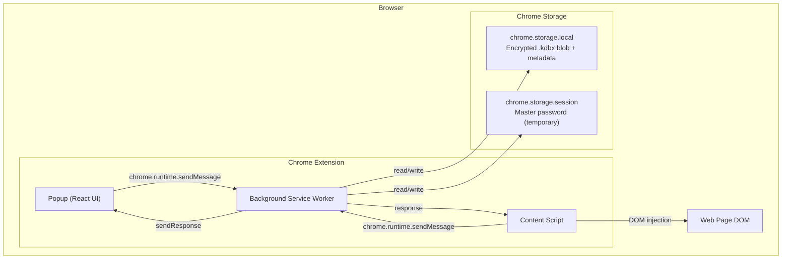

# KeePass Chrome Extension

[Русский](README.ru.md) | **English**

KeePass-compatible password manager as a Chrome extension. Runs entirely in the browser — all data is encrypted locally and never sent anywhere.

## Features

- **Create and open `.kdbx` databases** — full KeePass 2.x compatibility
- **Import/export** — open existing KeePass database or create a new one
- **Password management** — add, edit, delete entries; fill in URL for autofill on sites
- **Search** — quick search by title, login, URL and tags
- **Password generator** — configurable generator with strength meter
- **Autofill** — open the extension on a login page to see matching entries and click Fill
- **Copy to clipboard** — with auto-clear after 15 seconds
- **Auto-lock** — database locks automatically after 15 minutes of inactivity

## Security

- Master password is **never stored** — used only to derive the encryption key
- Database stored encrypted (AES-256 / ChaCha20) in `.kdbx` format
- Encryption key exists in memory only while the database is unlocked
- Fill is triggered only when you click — scripts run on user action
- Clipboard is automatically cleared after copying a password

## Installation

### Requirements

- [Node.js](https://nodejs.org/) 18 or higher
- Google Chrome (or any Chromium-based browser)

### Build from source

```bash
# Clone the repository
git clone https://github.com/your-username/keepass-chrome-extension.git
cd keepass-chrome-extension

# Install dependencies
npm install

# Build the extension
npm run build
```

The built extension will be in `.output/chrome-mv3/`.

### Load in Chrome

1. Open `chrome://extensions/` in Chrome
2. Enable **Developer mode** (toggle in top right)
3. Click **Load unpacked**
4. Select the `.output/chrome-mv3/` folder

## Development

```bash
# Start dev server with hot reload
npm run dev

# TypeScript type check
npm run compile

# Build for Firefox
npm run build:firefox

# Create .zip for publication
npm run zip
```

With `npm run dev`, the extension with hot reload will be in `.output/chrome-mv3-dev/` — load that folder via "Load unpacked" in Chrome.

## Usage

### First launch

1. Click the extension icon in the Chrome toolbar
2. Choose **Create New** to create a new database or **Import File** to open an existing `.kdbx` file
3. Set a master password (at least 8 characters)

### Password management

- **Add entry** — "Add Entry" button at the bottom of the list
- **View** — click an entry in the list
- **Edit** — "Edit" button on the entry page
- **Delete** — "Delete" (with confirmation)
- **Copy** — copy icon next to login, password, and URL fields

The popup always restores the last page and form drafts when reopened. You can close it to copy from elsewhere — your data will be there when you reopen.

### Password generator

Available via the key icon in the header or when creating/editing an entry (refresh button next to the password field). Options:
- Length (4–64 characters)
- Uppercase / lowercase letters
- Digits
- Special characters
- Exclude ambiguous characters (0/O, 1/l/I)

### Autofill

**Fill in the URL field** when creating or editing an entry — this is required for autofill. Enter just the hostname (e.g. `italki.com` or `mail.example.com`); no `https://` needed.

To fill a password: open the extension while on a login page. If you have a matching entry, you'll see "On this page" with a **Fill** button. Click it to fill username and password.

## Project structure

```
├── entrypoints/
│   ├── background.ts          # Service Worker — extension core
│   │                          # (no content script — fill via popup + scripting)
│   └── popup/                 # Popup UI (React)
│       ├── App.tsx            # Page routing
│       ├── pages/             # CreateVault, Unlock, EntryList,
│       │                      #   EntryDetail, EntryForm, Generator
│       └── components/        # PasswordInput, CopyButton, StrengthMeter
├── lib/
│   ├── kdbx.ts                # kdbxweb wrapper — .kdbx database handling
│   ├── crypto-setup.ts        # Argon2 (hash-wasm) init for kdbxweb
│   ├── storage.ts             # chrome.storage.local / session persistence
│   ├── messages.ts            # Typed messaging API
│   ├── password-generator.ts  # Password generator
│   ├── clipboard.ts           # Copy with auto-clear
│   ├── types.ts               # Shared TypeScript types
│   ├── constants.ts           # Settings and constants
│   └── fflate-worker-shim.js  # fflate compatibility shim for MV3 SW
├── wxt.config.ts              # WXT + Vite + Tailwind config
├── tsconfig.json
└── package.json
```

## Tech stack

| Technology | Purpose |
|---|---|
| [TypeScript](https://www.typescriptlang.org/) | Development language |
| [WXT](https://wxt.dev/) | Chrome Extensions framework (Manifest V3) |
| [React 19](https://react.dev/) | UI framework |
| [Tailwind CSS 4](https://tailwindcss.com/) | Styling |
| [kdbxweb](https://github.com/nicolo-ribaudo/nickel-keepass) | .kdbx format handling (KeePass 2.x) |
| [hash-wasm](https://github.com/nickel-nickel/nickel-hash-wasm) | Argon2 key derivation (WASM) |
| [Vite](https://vite.dev/) | Bundler (via WXT) |

---

## Architecture

### High-Level Overview

The extension follows Chrome Manifest V3 with three isolated components communicating via Chrome messaging APIs:



### Component responsibilities

**Background Service Worker** — central hub; database ops, crypto init, message routing, auto-lock/unlock, clipboard management.

**Popup UI** — React SPA (CreateVault, Unlock, EntryList, EntryDetail, EntryForm, Generator).

**Content Script** — detects login forms, requests matching entries from background, shows extension icon on password field, fills on click.

### Message protocol

Typed messages in `lib/messages.ts`: GET_STATE, CREATE_DATABASE, IMPORT_DATABASE, UNLOCK, LOCK, GET_ENTRIES, GET_ENTRY, CREATE_ENTRY, UPDATE_ENTRY, DELETE_ENTRY, GET_GROUPS, GENERATE_PASSWORD, COPY_TO_CLIPBOARD, EXPORT_DATABASE, GET_ENTRIES_FOR_URL, FILL_IN_TAB.

### Security

- **Encryption**: Argon2 KDF → AES-256-CBC / ChaCha20, ProtectedValue for fields
- **Session**: master password in `chrome.storage.session` (cleared on browser quit)
- **Auto-lock**: 15 min via `chrome.alarms`
- **Clipboard**: auto-clear 15 s after copy

### Storage

| Layer | Contents | Lifetime |
|---|---|---|
| chrome.storage.local | Encrypted .kdbx blob, metadata | Persistent until uninstall |
| chrome.storage.session | Master password | Until browser quit |
| In-memory | Decrypted Kdbx | Until lock / SW termination |

## License

MIT
