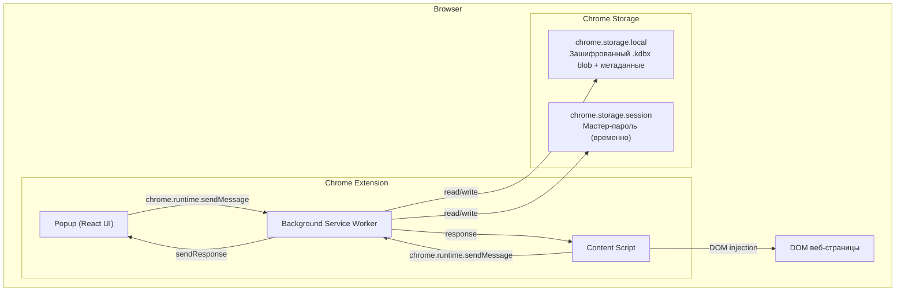

# KeePass Chrome Extension

**Русский** | [English](README.md)

KeePass-совместимый менеджер паролей в виде расширения для Chrome. Работает полностью в браузере — все данные шифруются локально и никуда не отправляются.

## Возможности

- **Создание и открытие `.kdbx` баз** — полная совместимость с KeePass 2.x
- **Импорт/экспорт** — можно открыть существующую базу KeePass или создать новую
- **Управление паролями** — добавление, редактирование, удаление записей; URL для автозаполнения на сайтах
- **Поиск** — быстрый поиск по названию, логину, URL и тегам
- **Генератор паролей** — настраиваемый генератор с оценкой сложности
- **Автозаполнение** — автоматическая подстановка логина и пароля на сайтах при совпадении URL
- **Копирование в буфер** — с автоматической очисткой через 15 секунд
- **Авто-блокировка** — база автоматически блокируется после 15 минут неактивности

## Безопасность

- Мастер-пароль **нигде не сохраняется** — используется только для получения ключа шифрования
- База данных хранится в зашифрованном виде (AES-256 / ChaCha20) через формат `.kdbx`
- Ключ шифрования находится в памяти только пока база разблокирована
- Content script не хранит пароли — получает их только в момент автозаполнения
- Буфер обмена автоматически очищается после копирования пароля

## Установка

### Требования

- [Node.js](https://nodejs.org/) версии 18 или выше
- Google Chrome (или любой Chromium-браузер)

### Сборка из исходников

```bash
# Клонировать репозиторий
git clone https://github.com/your-username/keepass-chrome-extension.git
cd keepass-chrome-extension

# Установить зависимости
npm install

# Собрать расширение
npm run build
```

Собранное расширение появится в папке `.output/chrome-mv3/`.

### Загрузка в Chrome

1. Открой `chrome://extensions/` в Chrome
2. Включи **Developer mode** (переключатель в правом верхнем углу)
3. Нажми **Load unpacked**
4. Выбери папку `.output/chrome-mv3/`

## Разработка

```bash
# Запуск dev-сервера с hot reload
npm run dev

# Проверка типов TypeScript
npm run compile

# Сборка для Firefox
npm run build:firefox

# Создание .zip для публикации
npm run zip
```

При запуске `npm run dev` расширение с hot reload появится в `.output/chrome-mv3-dev/` — загрузи эту папку через "Load unpacked" в Chrome.

## Использование

### Первый запуск

1. Нажми на иконку расширения в панели Chrome
2. Выбери **Create New** для создания новой базы или **Import File** для открытия существующего `.kdbx` файла
3. Задай мастер-пароль (минимум 8 символов)

### Управление паролями

- **Добавить запись** — кнопка "Add Entry" внизу списка
- **Просмотреть** — клик по записи в списке
- **Редактировать** — кнопка "Edit" на странице записи
- **Удалить** — кнопка "Delete" (с подтверждением)
- **Копировать** — иконка копирования рядом с полями логина, пароля и URL

Popup всегда восстанавливает последнюю страницу и черновики форм при повторном открытии. Можно закрыть окно для копирования из других источников — данные сохранятся.

### Генератор паролей

Доступен через иконку ключа в шапке или при создании/редактировании записи (кнопка со стрелками рядом с полем пароля). Настройки:
- Длина (4–64 символа)
- Заглавные / строчные буквы
- Цифры
- Спецсимволы
- Исключение неоднозначных символов (0/O, 1/l/I)

### Автозаполнение

**Заполните поле URL** при создании или редактировании записи — это необходимо для автозаполнения. Введите только хост (например, `italki.com` или `mail.example.com`); `https://` не нужен. Расширение сопоставит его с посещаемым сайтом.

Когда база разблокирована и вы заходите на сайт с сохранённым паролем (совпадающий URL), рядом с полями логина и пароля появится зелёная иконка расширения. Нажмите на неё — имя пользователя и пароль будут заполнены автоматически.

## Структура проекта

```
├── entrypoints/
│   ├── background.ts          # Service Worker — ядро расширения
│   ├── content.ts             # Content Script — автозаполнение на сайтах
│   └── popup/                 # Popup UI (React)
│       ├── App.tsx            # Роутинг между страницами
│       ├── pages/             # CreateVault, Unlock, EntryList,
│       │                      #   EntryDetail, EntryForm, Generator
│       └── components/        # PasswordInput, CopyButton, StrengthMeter
├── lib/
│   ├── kdbx.ts                # Обёртка над kdbxweb — работа с .kdbx базой
│   ├── crypto-setup.ts        # Инициализация Argon2 (hash-wasm) для kdbxweb
│   ├── storage.ts             # Сохранение в chrome.storage.local / session
│   ├── messages.ts            # Типизированный messaging API
│   ├── password-generator.ts  # Генератор паролей
│   ├── clipboard.ts           # Копирование с авто-очисткой
│   ├── types.ts               # Общие TypeScript-типы
│   ├── constants.ts           # Настройки и константы
│   └── fflate-worker-shim.js  # Шим для совместимости fflate с MV3 SW
├── wxt.config.ts              # Конфигурация WXT + Vite + Tailwind
├── tsconfig.json
└── package.json
```

## Стек технологий

| Технология | Назначение |
|---|---|
| [TypeScript](https://www.typescriptlang.org/) | Язык разработки |
| [WXT](https://wxt.dev/) | Фреймворк для Chrome Extensions (Manifest V3) |
| [React 19](https://react.dev/) | UI-фреймворк |
| [Tailwind CSS 4](https://tailwindcss.com/) | Стилизация |
| [kdbxweb](https://github.com/nicolo-ribaudo/nickel-keepass) | Работа с форматом .kdbx (KeePass 2.x) |
| [hash-wasm](https://github.com/nickel-nickel/nickel-hash-wasm) | Argon2 key derivation (WASM) |
| [Vite](https://vite.dev/) | Сборщик (через WXT) |

---

## Архитектура

### Обзор

Расширение использует Chrome Manifest V3: три изолированных компонента общаются через Chrome messaging API:



### Роль компонентов

**Background Service Worker** — центральный узел: операции с базой, инициализация крипто, маршрутизация сообщений, авто-блокировка/разблокировка, управление буфером обмена.

**Popup UI** — React SPA (CreateVault, Unlock, EntryList, EntryDetail, EntryForm, Generator).

**Content Script** — обнаруживает формы входа, запрашивает подходящие записи у background, показывает иконку расширения на поле пароля, заполняет по клику.

### Протокол сообщений

Типизированные сообщения в `lib/messages.ts`: GET_STATE, CREATE_DATABASE, IMPORT_DATABASE, UNLOCK, LOCK, GET_ENTRIES, GET_ENTRY, CREATE_ENTRY, UPDATE_ENTRY, DELETE_ENTRY, GET_GROUPS, GENERATE_PASSWORD, COPY_TO_CLIPBOARD, EXPORT_DATABASE, GET_ENTRIES_FOR_URL.

### Безопасность

- **Шифрование**: Argon2 KDF → AES-256-CBC / ChaCha20, ProtectedValue для полей
- **Сессия**: мастер-пароль в `chrome.storage.session` (очищается при закрытии браузера)
- **Авто-блокировка**: 15 мин через `chrome.alarms`
- **Буфер обмена**: авто-очистка через 15 с после копирования

### Хранение данных

| Уровень | Содержимое | Время жизни |
|---|---|---|
| chrome.storage.local | Зашифрованный .kdbx blob, метаданные | До удаления расширения |
| chrome.storage.session | Мастер-пароль | До закрытия браузера |
| В памяти | Расшифрованный Kdbx | До блокировки / завершения SW |

## Лицензия

MIT
